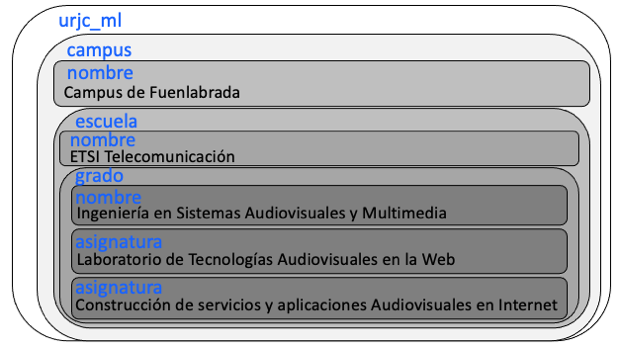

Ejercicio 1

<!DOCTYPE urjc_ML SYSTEM "urjc_ml.dtd">
<urjc_ml>
  <!-- include URL URJC -->
  <campus>
    <nombre>Campus de Fuenlabrada</nombre>
    <escuela>
      <nombre>ETSI Telecomunicación</nombre>
      <grado>
        <nombre>Ingeniería en Sistemas Audiovisuales y Multimedia </nombre>
        <asignatura>Laboratorio de Tecnologias Audiovisuales en la Web</asignatura>
        <asignatura>Construcción de servicios y Aplicaciones Audiovisuales en Internet</asignatura>
      </grado>
    </escuela>
  </campus>
</urjc_ml>

    a) Explica para qué sirve la primera línea del documento y por qué es necesaria
La primera línea tiene la etiqueta especial DOCTYPE (definida en SGML) que sirve para indicar el fichero donde está la definición del lenguaje usado (en este caso urjc-ml).
La primera línea es necesaria porque se necesita conocer el fichero local, que en este caso es urjc_ml.dtd, para saber qué etiquetas son válidas y poder validar el documento o encontrar errores en su sintáxis.

    b) Si se omitiese esta línea, ¿Qué piensas que ocurriría?
Si se omite esta línea, se produce un error. El analizador sintáctico no sabe de qué tipo de documento se trata y no podrá analizarlo.

    c) Sin conocer el contenido del fichero urjc_ml.dtd, ¿el documento es sintácticamente correcto?
No se puede saber si el contenido del fichero urjc_ml.dtd es sintácticamente correcto sin verlo, sin embargo, si las etiquetas siguen la sintáxis de SGML será correcto, pero puede que no sea válido ya que puede ser que la etiqueta no esté definida, o que la etiqueta tuviera otro nombre.
En el documento DTD tienen que estar definidas las etiquetas de nuestro lenguaje.

    d) ¿Qué hace la tercera línea?
La tercera línea es un comentario que pone el creador para informar.

    e) ¿Cuantas etiquetas de apertura hay? ¿Cuantas de cierre?
Etiquetas de apertura: 9
<urjc_ml>, <campus>, <nombre>, <escuela>, <nombre>, <grado>, <nombre>, <asignatura> y <asignatura>
Etiquetas de cierre: 9
</urjc_ml>, </campus>, </nombre>, </escuela>, </nombre>, </grado>, </nombre>, </asignatura> y </asignatura>
 
 La primera etiqueta es especial: Es autocontenida. Lo mismo que la etiqueta del comentario.

    f) Dibuja el diagrama de contenedores de este documento

    g) Dibuja la estructura en árbol que define este documento

