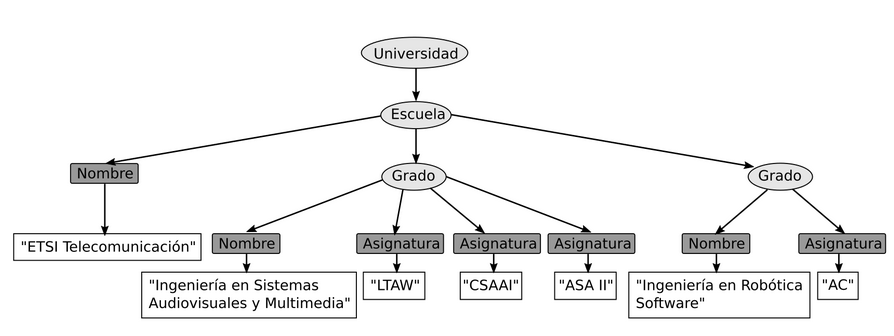

Ejercicio 2:
Este arbol representa la estructura del tipo de documento universidad, que está definido en el archivo llamado universidad.dtd. Los nombres de las etiquetas de cada elemento del árbol están escritos en los nodos. Estos nombres son válidos y se encuentra definidos dentro del documento DTD

    a) Escribe el documento en SGML que representa esa estructura

<!DOCTYPE universidad SYSTEM "universidad.dtd">
<Universidad>
    <!-- include URL universidad -->
    <Escuela>
        <Nombre>ETSI Telecomunicación</Nombre>
        <Grado>
            <Nombre>Ingeniería en Sistemas Audiovisuales y Multimedia </Nombre>
            <Asignatura>LTAW</Asignatura>
            <Asignatura>CSAAI</Asignatura>
            <Asignatura>ASA II</Asignatura>
        </Grado>
        <Grado>
            <Nombre>Ingeniería en Robótica Software </Nombre>
            <Asignatura>AC </Asignatura>
        </Grado>
    </Escuela>
</Universidad>

    b) ¿Cuántos elementos contenedores hay? Indica sus nombres
Hay 11 elementos contenedores (contienen otros elementos en su interior) y son:
* En el nivel 0: Universidad
* En el nivel 1: Escuela
* En el nivel 2: Nombre, Grado, Grado
* En el nivel 3: Nombre, Asignatura, Asignatura, Asignatura, Nombre, Asignatura

    c) ¿Cuantos elementos terminales hay? Indica sus valores
* En el nivel 3: "ETSI Telecomunicación"
* En el nivel 4: "Ingeniería en Sistemas Audiovisuales y Multimedia", "LTAW", "CSAAI", "ASA II", "Ingeniería en Robótica Software", "AC"

    d) ¿Cuantos elementos hay en el nivel 3? Escribe sus nombres
Hay 7 elementos en el nivel 3 y son:
"ETSI Telecomunicacion", "Nombre", "Asignatura", "Asignatura", "Asignatura", "Nombre", "Asignatura"

