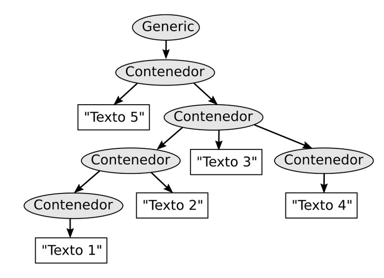

Ejercicio 3:
Este arbol representa la estructura del tipo de documento generic, que está definido en el archivo llamado generic.dtd. Los nombres de las etiquetas de cada elemento del árbol están escritos en los nodos. Estos nombres con válidos y se encuentra definidos dentro del documento DTD

    a) Escribe el documento en SGML que representa esa estructura.

<!DOCTYPE Generic SYSTEM "generic.dtd">
<Generic>
    <Contenedor>
        Texto 5
        <Contenedor>
            <Contenedor> 
                <Contenedor> Texto 1</Contenedor>
                Texto 2
            </Contenedor>
            Texto 3
            <Contenedor>Texto 4 </Contenedor>
        </Contenedor>
    </Contenedor>
</Generic>

    b) ¿Cuántos elementos hay en total?
En total hay 11 elementos.

    c) ¿Cuántos elementos terminales hay?. Indica sus valores
Hay 5 elementos terminales.
* En el nivel 2 hay: 1, "Texto 5"
* En el nivel 3 hay: 1, "Texto 3"
* En el nivel 4 hay: 2, "Texto 2", "Texto 4"
* En el nivel 5 hay: 1, "Texto 1"

    d) ¿Cuántos elementos no terminales hay?. Indica cuántos hay en cada nivel
Hay 6 elementos no terminales.
* En el nivel 0 hay: 1, Generic
* En el nivel 1 hay: 1, Contenedor
* En el nivel 2 hay: 1, Contenedor
* En el nivel 3 hay: 2, Contenedor, Contenedor
* En el nivel 4 hay: 1, Contenedor
* En el nivel 5 no hay
    
    e) ¿Cuántos elementos hay en el nivel 5?.Indica sus nombres
* En el nivel 5 hay: 1, "Texto 1"
